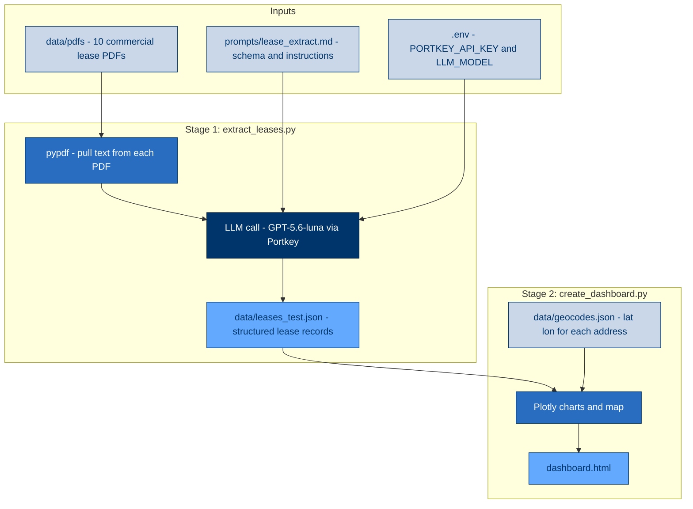

# Lease extraction process flow

```mermaid
flowchart TB
    subgraph inputs [Inputs]
        pdfs["data/pdfs - 10 commercial lease PDFs"]
        promptFile["prompts/lease_extract.md - schema and instructions"]
        envFile[".env - PORTKEY_API_KEY and LLM_MODEL"]
    end

    subgraph stage1 [Stage 1: extract_leases.py]
        pypdf["pypdf - pull text from each PDF"]
        llmCall["LLM call - GPT-5.6-luna via Portkey"]
        leaseJson["data/leases_test.json - structured lease records"]
    end

    subgraph stage2 [Stage 2: create_dashboard.py]
        geo["data/geocodes.json - lat lon for each address"]
        plotly["Plotly charts and map"]
        htmlOut["dashboard.html"]
    end

    pdfs --> pypdf
    pypdf --> llmCall
    promptFile --> llmCall
    envFile --> llmCall
    llmCall --> leaseJson
    leaseJson --> plotly
    geo --> plotly
    plotly --> htmlOut

    classDef input fill:#c9d7e8,stroke:#00356b,color:#00356b
    classDef process fill:#286dc0,stroke:#00356b,color:#ffffff
    classDef llmnode fill:#00356b,stroke:#001a36,color:#ffffff
    classDef output fill:#63aaff,stroke:#00356b,color:#00356b

    class pdfs,promptFile,envFile,geo input
    class pypdf,plotly process
    class llmCall llmnode
    class leaseJson,htmlOut output
```
